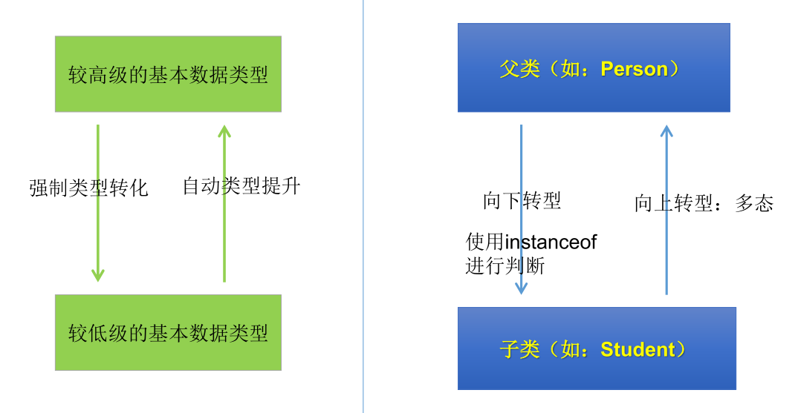
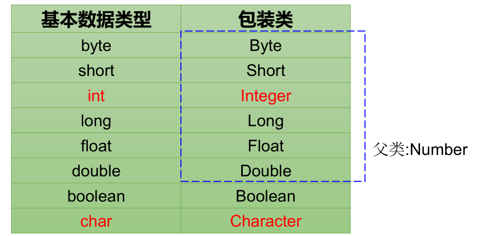

# 面向对象

### 1.类与对象

* 类（class）和对象（Object）是面向对象的核心概念。  
  -> 类：  
  -> 对象：
  
### 2.类的结构

属性、方法、构造器；代码块、内部类；

 **2.1 属性**
 
 

 **2.2 方法**
 
 **1. 方法的重载**
 
 
 **2. 方法的重写**
 
 * **定义：**子类继承了父类后，可以对父类同名同参数列表的方法进行覆盖操作。
 
 * 应用：重写后，子类可以调用自己写的这个方法，实际上也是拓展了。
 * **规定**：  
 　①子类重写的方法名和参数列表必须与父类被重写的方法相同；  
 　②子类重写的方法的修饰符的权限大小**不小于**父类被重写方法修饰符  
 　　特殊情况：子类不能重写父类修饰符为 *private* 权限的方法  
 　③返回值类型：  
 　　->父类被重写的方法返回值类型是 *void* 或者基本数据类型，则子类重写的方法返回值类型必须是 void 或对应的基本数据类；  
 　　->父类被重写的方法返回值类型是A类型，则子类重写的方法返回值类型可以是A类或A的子类；
 
 
 

 **2.3 构造器**
 
1.构造器的作用
 
 * 1.创建对象
 * 2.初始化对象的信息
 
2.使用说明
  
 
 
3.举例
 
4.属性赋值的顺序
 
 ① 默认初始化
 
 ② 显示初始化
 
 ③ 构造器中初始化
 
 ④ 通过“对象.方法”或“对象.属性”赋值
 
5.JavaBean的概念
 
 所谓JavaBean就是指符合以下标准的Java类：
 * 类是公共的
 * 有一个无参的公共的构造器
 * 属性，且对应的get、set方法

### 3.面向对象的特征

<b>3.1 封装</b>
 
 * 体现一：将类的属性私有化，同时提供get、set方法
 
 * 体现二：不对外暴露的私有的方法
 
 * 体现三：单例模式
 
 * 体现四：如果不希望类在包外被调用，可以将包设置为缺省的。
 
 ** 3.1.1 Java的四种权限修饰符**
 
  　① 从小到大排序：private、defaul(缺省的)、protected、public   
  　② 四种权限修饰符可以修饰类及类的结构：属性、方法、构造器、内部类   
  　③ 修饰类只能使用 public 和 缺省的
 
 
 
 
 <b>3.2 继承</b>
 
 **3.2.1 继承性的好处**
 
 　①减少了代码冗余，提高了代码的复用性。  
 　②更有利于功能的扩展。   
 　③让类与类之间产生了关系，提供了多态的前提。
 
 **3.2.2 继承性的格式**
 
 class A extends B{}
 
 **3.2.3 子类继承父类后有哪些不同**
 
 - 体现：一旦子类A继承了父类B以后，A就拥有B声明的所有属性和方法。
 （特别的，当B中使用private声明属性和方法的时候，还是认为A继承了该属性或方法，只是因为封装性的影响，使得子类不能直接调用该结构而已。）
 - 子类继承父类以后，还可以自己声明特有的属性、方法，实现功能的拓展。
 
 **3.2.4 Java继承性的说明**
 
 1. 一个类可以被多个子类继承。
 2. Java中的类继承是单继承性。
 3. 子父类是相对概念。
 4. 子类直接继承的叫，直接父类；间接继承的叫间接父类。
 5. 子类继承父类后，就获取了直接父类和间接父类声明的所有属性和方法。
 
 **3.2.5 Java.lang.Obcject类的理解**
 
 
 **3.2.6 子类对象实力化的全过程**
 
 1. 从结果上看：
  子类继承父类后，就拥有父类的所有属性方法  
 创建子类是实例化对象时，就在堆空间中创建了父类的属性。
  
 2. 从过程来看：
  

<b>3.3 多态</b>
 
**3.3.1 多态性定义**

- **父类的引用指向子类的对象**（或叫做子类的对象赋给父类的引用）。
 
**3.3.2 多态的使用**

　对象多态，编译的时候只能调用父类声明的方法，运行的时候调用的是子类的重写方法。（虚拟方法）  
　使用前提：①继承、②方法重写  
　**对象的多态性只适用方法，不适用属性！**——如果使用父类对象声明实例化，该对象调用属性时，调用的是父类的属性！

**3.3.3 多态的作用**

　提高了代码的通用性

**3.3.4 类型转换**

　多态的使用格式：  
>class A {}  
class B extends A{}  

>A a = new B();  
B b = (B)a;   

　其中，第一行实例化，是多态的表现，也是向上转型；  
　第二行是向下转型，类似基本数据类型的强转。

>A a1 = new A();  
B b1 = (B)a1;

* **这种在编译的时候不会报错，但是在运行的时候可能会报错。**  
所以需要使用instanceof判断以下  

**3.3.5 instanceof**

　用法： `A instanceof B`　检验A是否为B类的对象，返回值为boolean值。

> A所属的类与类B 是子类和父类关系，否则编译报错  
> 如果A所属的类是类B的子类，返回值为true；但如果A所属的类是类B的父类，则为false；

 
 
 
### 4.关键字

<b>4.1 this</b>

代表为当前对象。

** 4.1.1 可以调用的结构**

属性、方法、构造器

** 4.1.2 this调用属性、方法、构造器**

① 通常情况下省略this，特殊情况下，如 方法、构造器的形参和类的属性同名时，必须显式使用this。

② this调用构造器：构造器中可以通过this调用其他构造器，但不能调用自己这个构造器；且类中this调用构造器不能产生死循环。一个构造器中最多只能调用另外一个构造器。

<b>4.2 package/import</b>

1.package(包)的作用

- 包帮助管理大型软件系统：将功能相近的类划分到同一个包中。比如：MVC的设计模式
- 包可以包含类和子包，划分项目层次，便于管理
- 解决类命名冲突的问题
-  控制访问权限

-  例：某航运软件系统包括：一组域对象、GUI和reports子系统

2.import的注意点

1. 在源文件中使用import显式的导入指定包下的类或接口
2. 声明在包的声明和类的声明之间。
3. 如果需要导入多个类或接口，那么就并列显式多个import语句即可
4. 举例：可以使用java.util.*的方式，一次性导入util包下所有的类或接口。
5. 如果导入的类或接口是java.lang包下的，或者是当前包下的，则可以省略此import语句。
6. 如果在代码中使用不同包下的同名的类。那么就需要使用类的全类名的方式指明调用的是哪个类。
7. 如果已经导入java.a包下的类。那么如果需要使用a包的子包下的类的话，仍然需要导入。
8. import static组合的使用：调用指定类或接口下的静态的属性或方法

 
<b>4.3 super</b>

代表为父类的。

**4.3.1 可以调用的结构**

　属性、方法、构造器

**4.3.2 super的使用**

1. 在子类的方法或构造器中，使用“super.属性或方法”，使用父类的属性或方法；
2. 特别的，子类重写了父类的方法或者子类有与父类同名的属性，子类在调用的这些父类的方法或属性时，必须显式使用“super.”方式；
3. super调用构造器：在子类构造器中，this(参数列表)和super(参数列表)只能二选一。  
　*注意：没有显示的声明this或者super的话，表示的是默认调用super()父类的空参构造。*

**4.3.3 this和super的区别**

1. 属性、方法，this方式访问属性、方法，本类中没有的话会从父类中继续查找；super方式访问属性、方法，将直接使用父类的。
2. 构造器，this调用构造器，必须放在构造器的首行；super调用父类的构造，必须放在子类构造器的首行。

 
<b>4.4 static</b>

静态关键字

**1. 理解**  

在创建一个对象时，如果这个对象的一个属性或方法是该类所有对象公共的，则可以使用关键字static修饰。  

*实例变量*：

*类变量*：

*类方法*：

**2. 内存解析**

**3. 单例模式**

定义，理解的：

### 5. Object与包装类的使用

<b>5.1 Object</b>

Object是Java所有类的根父类。  
如果在类的声明中没有使用extends，则默认该类的父类是Java.lang.Object类。  

Object中没有属性，只有方法，一个空参构造器。常用的方法有：  
`equals()、toString()、hashCode()`

　1.== 与 equals 比较  
　 == 是运算符号，equals是方法。  
　 == 进行的是基本数据类型的值运算，如果是引用类型，则判断的是其地址值是否相等；  
 　equals比较的是两个引用数据类型，所有的类都继承了Object类的equals()方法，可以重写，没有重写其作用与 == 相同。 

　2.重写equals的原则

* 对称性：  
* 自反性：  
* 一致性：  

可以自动生成。

　3.toString()方法    

　返回的是类名和引用地址。  
　在进行连接操作时，自动调用toString() 方法。  
　基本类型转换为String类型的时候，调用的是其对应的包装类的toString()方法。

 
 　4.hashCode()方法  
 
 　

<b>5.2 包装类</b>

5.2.1 单元测试的方法

JUnitTest

5.2.2 包装类  

8种基本数据类型都有其对应的引用类型-包装类（封装类）。

jdk 5.0之后  
自动装箱和拆箱

基本类型、包装类、String的转换

>Integer i = new Integer(10);  
i.toString()

>String str = "123";  
int n = str.valueOf(str);

